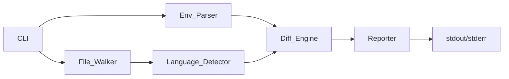

# Design Document: capture-env-analyzer

## Overview

The capture-env-analyzer is a static analysis CLI tool that identifies mismatches between environment variables declared in .env files and those referenced in source code. The tool performs pattern-based detection across JavaScript, TypeScript, Go, and Python codebases, producing deterministic reports suitable for CI/CD integration.

The design follows a pipeline architecture where each component has a single responsibility:
1. Parse .env file to extract declared variables
2. Traverse project directory to find source files
3. Detect environment variable usage patterns in source code
4. Compare declared vs used variable sets
5. Generate deterministic reports

Key design goals:
- Streaming file processing for memory efficiency (O(n) space complexity)
- Deterministic output for CI/CD reliability
- Modular architecture for language extensibility
- Pattern-based detection without AST parsing

## Architecture

The system follows a pipeline architecture with six main components:



### Component Responsibilities

**CLI**: Entry point that validates flags, coordinates execution flow, and handles exit codes.

**Env_Parser**: Reads .env files line-by-line, extracts variable names matching `^[A-Z][A-Z0-9_]*$`, returns a unique set (map[string]bool).

**File_Walker**: Recursively traverses directories, filters by extension (.js, .ts, .go, .py), respects ignore patterns, yields file paths.

**Language_Detector**: Applies regex patterns to detect environment variable usage, records locations (file path + line number), returns a map of variable names to location lists.

**Diff_Engine**: Pure computation component that performs set operations (declared - used, used - declared), sorts results alphabetically.

**Reporter**: Formats output sections, writes to stdout/stderr, ensures deterministic ordering.

### Data Flow

1. CLI validates flags and checks file/directory existence
2. Env_Parser reads .env file → map[string]bool of declared variables
3. File_Walker traverses scan directory → []string of file paths
4. Language_Detector processes each file → map[string][]Location
5. Diff_Engine compares sets → DiffResult{Unused: []string, Missing: []string}
6. Reporter formats and outputs results
7. CLI exits with appropriate code (0=success, 1=mismatch, 2=error)

## Components and Interfaces

### CLI Component

```go
type CLIFlags struct {
  Root    string
  EnvFile string
  Ignore  []string
}

func main() {
  // Parse flags
  // Validate file/directory existence
  // Coordinate pipeline execution
  // Exit with appropriate code
  os.Exit(exitCode)
}
```

Exit codes:
- 0: No mismatches detected
- 1: Mismatches found (unused or missing variables)
- 2: Configuration error (missing file, invalid flags, permissions)

### Env_Parser Component

```go
type EnvParser interface {
  Parse(filePath string) (map[string]bool, error)
}

type EnvParserImpl struct {
  keyPattern *regexp.Regexp
}

func NewEnvParser() *EnvParserImpl {
  return &EnvParserImpl{
    keyPattern: regexp.MustCompile(`^([A-Z][A-Z0-9_]*)=`),
  }
}

func (p *EnvParserImpl) Parse(filePath string) (map[string]bool, error) {
  // Read file line-by-line
  // Skip empty lines and comments (#)
  // Extract keys matching KEY=VALUE
  // Filter by ^[A-Z][A-Z0-9_]*$
  // Return unique set (map[string]bool for set semantics)
}
```

### File_Walker Component

```go
type FileWalker interface {
  Walk(rootDir string, ignoreDirs []string) ([]string, error)
}

type FileWalkerImpl struct {
  extensions    []string
  defaultIgnore []string
}

func NewFileWalker() *FileWalkerImpl {
  return &FileWalkerImpl{
    extensions:    []string{".js", ".ts", ".go", ".py"},
    defaultIgnore: []string{".git", "node_modules", "vendor"},
  }
}

func (w *FileWalkerImpl) Walk(rootDir string, ignoreDirs []string) ([]string, error) {
  // Recursively traverse directories using filepath.Walk
  // Skip symbolic links
  // Skip ignored directories
  // Collect files with matching extensions
  // Return slice of file paths
}
```

### Language_Detector Component

```go
type Location struct {
  FilePath   string // Relative to root
  LineNumber int
}

type LanguageDetector interface {
  Detect(filePath string) (map[string][]Location, error)
}

type JSDetector struct {
  patterns []*regexp.Regexp
}

func NewJSDetector() *JSDetector {
  return &JSDetector{
    patterns: []*regexp.Regexp{
      regexp.MustCompile(`process\.env\.([A-Z][A-Z0-9_]*)`),
      regexp.MustCompile(`process\.env\["([A-Z][A-Z0-9_]*)"\]`),
      regexp.MustCompile(`process\.env\['([A-Z][A-Z0-9_]*)'\]`),
    },
  }
}

func (d *JSDetector) Detect(filePath string) (map[string][]Location, error) {
  // Read file line-by-line
  // Apply regex patterns
  // Record matches with line numbers
  // Return map of variable → locations
}

type GoDetector struct {
  patterns []*regexp.Regexp
}

func NewGoDetector() *GoDetector {
  return &GoDetector{
    patterns: []*regexp.Regexp{
      regexp.MustCompile(`os\.Getenv\("([A-Z][A-Z0-9_]*)"\)`),
      regexp.MustCompile(`os\.LookupEnv\("([A-Z][A-Z0-9_]*)"\)`),
    },
  }
}

func (d *GoDetector) Detect(filePath string) (map[string][]Location, error) {
  // Similar to JSDetector
}

type PythonDetector struct {
  patterns []*regexp.Regexp
}

func NewPythonDetector() *PythonDetector {
  return &PythonDetector{
    patterns: []*regexp.Regexp{
      regexp.MustCompile(`os\.getenv\("([A-Z][A-Z0-9_]*)"\)`),
      regexp.MustCompile(`os\.environ\["([A-Z][A-Z0-9_]*)"\]`),
      regexp.MustCompile(`os\.environ\['([A-Z][A-Z0-9_]*)'\]`),
    },
  }
}

func (d *PythonDetector) Detect(filePath string) (map[string][]Location, error) {
  // Similar to JSDetector
}

type DetectorFactory struct{}

func (f *DetectorFactory) Create(extension string) LanguageDetector {
  // Return appropriate detector based on file extension
  switch extension {
  case ".js", ".ts":
    return NewJSDetector()
  case ".go":
    return NewGoDetector()
  case ".py":
    return NewPythonDetector()
  default:
    return nil
  }
}
```

### Diff_Engine Component

```go
type DiffResult struct {
  Unused  []string // Declared but not used
  Missing []string // Used but not declared
}

type DiffEngine interface {
  Compare(declared, used map[string]bool) DiffResult
}

type DiffEngineImpl struct{}

func NewDiffEngine() *DiffEngineImpl {
  return &DiffEngineImpl{}
}

func (e *DiffEngineImpl) Compare(declared, used map[string]bool) DiffResult {
  var unused, missing []string
  
  // Find unused: in declared but not in used
  for v := range declared {
    if !used[v] {
      unused = append(unused, v)
    }
  }
  
  // Find missing: in used but not in declared
  for v := range used {
    if !declared[v] {
      missing = append(missing, v)
    }
  }
  
  // Sort for deterministic output
  sort.Strings(unused)
  sort.Strings(missing)
  
  return DiffResult{Unused: unused, Missing: missing}
}
```

### Reporter Component

```go
type ReportData struct {
  Unused  []string
  Missing map[string]Location // Variable → first location
}

type Reporter interface {
  Report(data ReportData)
}

type ReporterImpl struct {
  out io.Writer
}

func NewReporter(out io.Writer) *ReporterImpl {
  return &ReporterImpl{out: out}
}

func (r *ReporterImpl) Report(data ReportData) {
  if len(data.Unused) == 0 && len(data.Missing) == 0 {
    fmt.Fprintln(r.out, "No environment mismatches found.")
    return
  }
  
  if len(data.Unused) > 0 {
    fmt.Fprintln(r.out, "Declared but unused:")
    for _, varName := range data.Unused {
      fmt.Fprintf(r.out, "- %s\n", varName)
    }
  }
  
  if len(data.Unused) > 0 && len(data.Missing) > 0 {
    fmt.Fprintln(r.out, "") // Blank line separator
  }
  
  if len(data.Missing) > 0 {
    fmt.Fprintln(r.out, "Used but not declared:")
    
    // Sort missing variables for deterministic output
    vars := make([]string, 0, len(data.Missing))
    for v := range data.Missing {
      vars = append(vars, v)
    }
    sort.Strings(vars)
    
    for _, varName := range vars {
      location := data.Missing[varName]
      fmt.Fprintf(r.out, "- %s (%s:%d)\n", varName, location.FilePath, location.LineNumber)
    }
  }
}
```

## Data Models

### Core Data Structures

**Variable Name**: String matching `^[A-Z][A-Z0-9_]*$`

- Uppercase letters, digits, underscores only
- Must start with uppercase letter
- Examples: `API_KEY`, `DATABASE_URL`, `MAX_RETRIES`

**Location**: Struct with FilePath (string) and LineNumber (int)
- FilePath is relative to scan directory
- LineNumber is 1-indexed
- Sorted by FilePath then LineNumber for determinism

**Variable Set**: map[string]bool
- Go idiom for set semantics (map with bool values)
- Used for declared variables from .env
- Used for used variables from source code

**Location Map**: map[string][]Location
- Maps variable name to all usage locations
- Locations sorted for deterministic output
- Used to track where variables appear in code

**Diff Result**: Struct with two slices
- Unused: Variables in .env but not in code
- Missing: Variables in code but not in .env
- Both slices sorted alphabetically

### File Format Specifications

**.env File Format**:
```
# Comments start with #
KEY=value
ANOTHER_KEY=value with spaces
INVALID_key=ignored  # Lowercase not allowed
```

**Supported Patterns by Language**:

JavaScript/TypeScript:
- `process.env.VAR_NAME`
- `process.env["VAR_NAME"]`
- `process.env['VAR_NAME']`

Go:
- `os.Getenv("VAR_NAME")`
- `os.LookupEnv("VAR_NAME")`

Python:
- `os.getenv("VAR_NAME")`
- `os.environ["VAR_NAME"]`
- `os.environ['VAR_NAME']`

**Ignored Patterns** (dynamic expressions):
- Template literals: `process.env[\`VAR_${x}\`]`
- Variable references: `process.env[varName]`
- Computed keys: `os.Getenv(getKey())`

